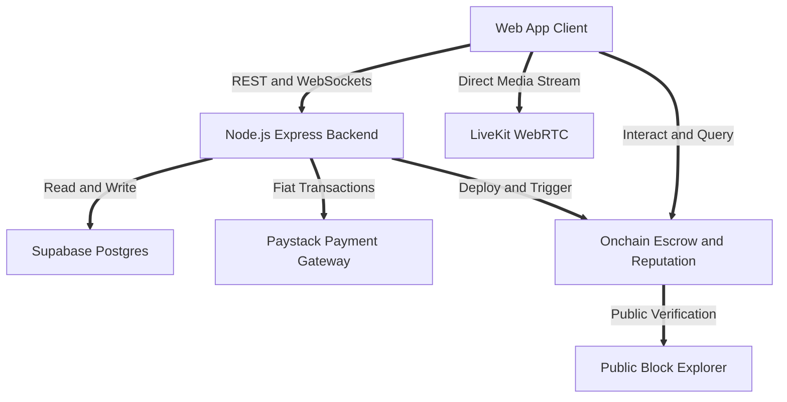

# Grind Campus Gig Economy

> Grind is a university first based LinkedIn and every popular job platform merged into one real no bullshit platform. It serves as an onchain reputation engine of work done. Grind is something that helps people track what they have done in their life and time in school no matter how little, building them a credibility to do things and creating a resume from work history. It is a trustless campus gig marketplace for Nigerian university students where you can post gigs, earn cNGN, stream live, and chat, all secured by smart contract escrow.

## Table of Contents

1. [Introduction](#introduction)
2. [Platform Architecture](#platform-architecture)
3. [Blockchain Explorer Transparency](#blockchain-explorer-transparency)
4. [Underlying Technology Stack](#underlying-technology-stack)
5. [Tech Stack](#tech-stack)
6. [Screens Overview](#screens-overview)
7. [Feature Details](#feature-details)
8. [Comprehensive Ecosystem Capabilities](#comprehensive-ecosystem-capabilities)
9. [Design System](#design-system)
10. [How to Use](#how-to-use)
11. [API Reference](#api-reference)
12. [Smart Contracts](#smart-contracts)
13. [Added Features](#added-features)

## Introduction

Grind redefines how university students build their professional footprint. While traditional job platforms focus on post graduation experience, Grind captures the hustle, the micro jobs, and the raw talent developed during school years. Whether it is tutoring a peer, designing a flyer, writing code, or delivering food across campus, every task completed on Grind contributes to an immutable onchain reputation. 

This creates a transparent and verified resume from your actual work history. No matter how little the job, Grind tracks your effort, evaluates your performance through client ratings, and builds your credibility. The platform acts as a powerful combination of LinkedIn and modern gig marketplaces but strictly tailored for the university ecosystem. It eliminates the friction of traditional networking by providing a real, transparent environment where students connect, work, and build a lasting reputation.

Students no longer need to rely on empty resumes or unprovable claims. Every gig executed through the platform produces verifiable proof of completion. This onchain record demonstrates work quality, punctuality, and client satisfaction directly to future employers, campus recruiters, and clients worldwide.

## Platform Architecture

Below is the high level architecture of the Grind ecosystem explaining how the frontend, backend, and smart contracts interact seamlessly.



The Web App Client communicates with the Node.js backend for authentication and data management. Real time chat and gig updates use WebSockets. Live streaming is handled completely by LiveKit for low latency video. Smart Contracts manage the cNGN escrow, ensuring that payments are locked until the gig is successfully completed, while also updating the GrindScore onchain to reflect the student credibility. Every event emitted by the smart contracts is indexed and immediately visible on the public block explorer.

## Blockchain Explorer Transparency

Grind is built on the foundation that reputation should be undeniable, public, and verifiable by anyone without trusting a central authority. Every critical financial and reputation event is anchored onchain and can be inspected in real time using any standard blockchain explorer.

### Public Transaction Verifiability
* Every escrow deposit creates a distinct transaction hash viewable on the block explorer
* Students and clients can click through directly to inspect the smart contract address, the exact amount of cNGN locked, the timestamp of initiation, and the authorized participant addresses
* The release of escrowed cNGN generates an irreversible payout receipt on the ledger, establishing irrefutable evidence of successful delivery
* Dispute resolutions and arbitrated refunds are recorded as public onchain events with immutable log outputs

### Onchain Resume and Credibility Audit
* A student wallet address functions as a verifiable public portfolio
* Anyone can paste a student wallet address into the block explorer to see the full chronological history of completed contracts
* GrindScore points minted to the student address cannot be artificially inflated, deleted, or fabricated
* Client ratings and gig completion proofs are permanently linked to the participant address, giving recruiters and employers absolute confidence in the authenticity of past performance
* Zero fake reviews and zero fabricated work history because every single point originated from an escrow settled agreement

## Tech Stack

<table>
  <thead>
    <tr>
      <th>Layer</th>
      <th>Stack</th>
    </tr>
  </thead>
  <tbody>
    <tr>
      <td>Frontend</td>
      <td>React 19, Vite, TailwindCSS v4, Radix UI, Lucide, Sonner</td>
    </tr>
    <tr>
      <td>Backend</td>
      <td>Node.js, Express, Socket.io</td>
    </tr>
    <tr>
      <td>Auth</td>
      <td>Supabase Email, Phone OTP, Google OAuth</td>
    </tr>
    <tr>
      <td>Payments</td>
      <td>Smart contract escrow cNGN token, Paystack</td>
    </tr>
    <tr>
      <td>Streaming</td>
      <td>LiveKit WebRTC</td>
    </tr>
    <tr>
      <td>Database</td>
      <td>Supabase Postgres</td>
    </tr>
    <tr>
      <td>Monorepo</td>
      <td>pnpm workspaces</td>
    </tr>
  </tbody>
</table>

## Underlying Technology Stack

Grind combines modern web performance with decentralized finance protocols to guarantee speed, security, and immutability.

### Smart Contract Layer
* GrindEscrow contract holds funds in trust until the client approves completion or the predefined timeout triggers
* GrindScore contract acts as a non transferable reputation token tallying points from verified work
* GrindDID contract anchors student campus status and identity attributes on the blockchain
* Native cNGN ERC20 standard token compliance enabling rapid, low fee transactions pegged to the Nigerian Naira

### Real Time Media and Communication
* LiveKit WebRTC Selective Forwarding Unit architecture for high definition campus video broadcasts
* Sub 100 millisecond stream latency allowing real time student questions, tutoring sessions, and interactive workshops
* Socket.io dual transport communication layer providing instant chat messaging with automatic HTTP long polling fallback
* Server side message sanitization and profanity filtering protecting the campus community

### Hybrid Fiat and Web3 Payment Engine
* Paystack checkout integration enabling easy Naira deposits via debit cards and dedicated virtual bank accounts
* Automated conversion and minting of cNGN stable value directly into the student non custodial wallet
* Transparent platform fee calculations showing exact operational and escrow costs prior to gig authorization
* Instant peer to peer transfers between students using simple campus handles without intermediary bank delays

## Screens Overview

<table>
  <thead>
    <tr>
      <th>Screen</th>
      <th>Entry Point</th>
    </tr>
  </thead>
  <tbody>
    <tr><td>Splash</td><td>App load 2.2 s auto advance</td></tr>
    <tr><td>Login Welcome</td><td>/login</td></tr>
    <tr><td>Login Phone and OTP</td><td>Phone flow</td></tr>
    <tr><td>Login Email and Register</td><td>Email flow</td></tr>
    <tr><td>Home Dashboard</td><td>home tab</td></tr>
    <tr><td>Gigs Board</td><td>gigs tab</td></tr>
    <tr><td>Gig Detail and Chat</td><td>Tap any gig card</td></tr>
    <tr><td>Post Gig</td><td>FAB + button</td></tr>
    <tr><td>Live Browse</td><td>live tab</td></tr>
    <tr><td>Live Watch and Chat and Gifts</td><td>Tap any stream</td></tr>
    <tr><td>Live Go Live or Creator</td><td>Go Live button</td></tr>
    <tr><td>Wallet and Leaderboard</td><td>wallet tab</td></tr>
    <tr><td>Profile</td><td>profile tab</td></tr>
    <tr><td>Settings</td><td>From Profile</td></tr>
  </tbody>
</table>

## Feature Details

### Authentication
* Animated splash screen with brand logo auto advances after 2.2 s
* Welcome screen with three sign in paths Google Phone Email
* Phone flow 6 digit OTP verification
* Email flow Registration form name email pre filled password with show hide
* Password minimum 6 characters enforced client side
* Persistent sessions stored in localStorage restored on reload
* Protected routes unauthenticated users always land on Login
* Referral tracking via URL param stored in sessionStorage

### Home Dashboard
* Personalised greeting Good morning afternoon evening
* Balance card cNGN balance with show hide eye toggle GrindScore and tier badge
* Three wallet quick buttons on card Add Money Transfer Withdraw
* Quick Actions row Browse Gigs Go Live Refer Friend Top Up
* Smart Pick banner dark card with Post your first gig CTA
* Exclusive Rewards banner linking to wallet
* Recommended gig feed featured gigs
* Notification bell unread red dot slide up notification panel
* Mark all notifications read in one tap
* Notification panel shows per item read unread styling

### Gigs Board
* Search bar with clear button filters title description category in real time
* Categories Writing Design Coding Tutoring Delivery Research Video Other
* Filter chips toggle category drawer
* Sort dropdown Newest First Highest Pay Lowest Pay Most Urgent
* Result count with clear filters shortcut
* Empty state with icon and clear all link
* Post Gig button in header same as FAB
* 10 seeded real gigs covering every category

### Gig Card
* Category colour badge unique colour combos
* Formatted cNGN price with badge
* 2 line title 1 line description clipped
* Poster avatar initial handle tier colour dot
* Deadline badge red for urgent hours 1 day green otherwise
* Escrow shield badge on every card

### Gig Detail
* Full poster card avatar handle tier dot GrindScore 5 star rating
* Chat button opens in app messenger with the poster
* Category and deadline chips
* Full title and description
* Payment breakdown table budget platform fee escrow fee doer earnings
* Trustless Escrow info card with smart contract explanation
* Poster profile section with completed task count and dispute rate
* Apply for Gig button pitch modal with 300 char textarea
* Applied state button replaced by green Applied confirmation
* Share gig copies URL to clipboard
* In app chat panel slide up messenger sent received bubble UI simulated auto reply send on Enter or tap

### Post a Gig 3 step wizard
* Progress bar across 3 steps back navigation on each
* Step 1 Details title 8 icon category grid description character counters
* Step 2 Budget Timeline large NGN input live fee breakdown 5 deadline presets minimum validation
* Step 3 Payment summary card three payment methods
* Wallet instant deduction from cNGN balance
* Debit Card Paystack integration
* Bank Transfer generates unique virtual account and reference number in a toast
* Escrow protection reminder on payment screen
* Success screen checkmark animation confirmation back to board

### Live Streaming
* Browse page featured stream hero card and all streams list
* Live Offline status indicator with animated pulse dot
* Viewer count on every stream card
* Category filter bar All Coding Design Tutoring Talk Music Gaming
* Go Live button red with Radio icon
* Watch screen Simulated video player Live viewer count Creator name follow button YouTube style live chat Heart reaction button Gift panel Gifting deducts from wallet
* Go Live screen Camera mic preview Stream title input Category selector Creator onboarding card Start Stream
* Live controls live timer mute toggle camera toggle end stream
* End stream returns to browse shows toast

### Wallet
* cNGN balance card with show hide toggle
* Add Money modal Quick amount chips Card payment Bank Transfer Balance updates in real time
* Withdraw modal amount input balance validation minimum 500 Arrives in 1 to 2 hours toast
* Send cNGN modal recipient handle and amount peer to peer transfer
* Transaction history every transaction stored with title amount date status type
* Type aware icons green arrow for earnings red arrow for spending
* Download statement toast confirmation
* Campus Leaderboard tab Trophy banner showing user campus rank Top 5 leaderboard with rank medals GrindScore and tier colour dot per entry

### Profile
* Avatar with camera icon change photo prompt
* Inline edit mode tap pencil to edit name and bio save cancel buttons
* Tier badge row with animated progress bar toward next tier score display
* Stats row Tasks Done On Time Rate Rating
* Total Earned cNGN card with accent styling
* Referral link copies URL to clipboard shows referral count
* Growth Stats modal Income Growth Response Rate Completion Rate bars Avg Delivery Safety Score
* Work History modal filterable by positive transactions per gig receipt download button
* Settings button
* Sign Out button danger red card

### Settings 6 sub screens
* User summary card at top with Edit shortcut
* My Profile name phone bio edit form save with validation
* Login Settings current and new password with show hide Transaction PIN setup button
* Payment Settings Add Debit Card Add Bank Account Withdrawal Settings Transaction Limits
* School and Level display only contact support to change
* Notifications 4 per type toggles
* Security Center Biometrics toggle 2FA toggle Active Sessions link
* Connected Accounts Google socials
* Themes Dark mode
* Feedback and Suggestions 500 char textarea sends to backend
* Help Center Terms and Privacy Policy About Grind
* Sign Out and Delete Account

## Comprehensive Ecosystem Capabilities

* Proof of Work History: Every gig completion acts as an authentic work certificate permanently anchored on the public blockchain
* Dynamic GrindScore Algorithm: Mathematical reputation score calculated directly from verified job ratings, project complexity, on time completion rate, and peer validation
* Campus Community Verification: Decentralized identity checks ensuring participants are actual students currently enrolled in university institutions
* Milestone Based Releases: Escrow support for complex projects allowing payments to unlock incrementally as specific deliverables are approved
* Live Stream Virtual Tipping: Audience members can reward live tutors, coders, and creators with cNGN gifts during interactive campus sessions
* Dispute Resolution Engine: Multi signature arbitration framework protecting both student gig workers and campus clients from non delivery or non payment
* Detailed Transaction Receipts: Downloadable digital receipts containing transaction hashes, timestamp proofs, and fee breakdowns for every wallet event

## Design System

<table>
  <thead>
    <tr>
      <th>Token</th>
      <th>Value</th>
    </tr>
  </thead>
  <tbody>
    <tr><td>Brand green</td><td>#00A651</td></tr>
    <tr><td>Accent dark</td><td>#007A3D</td></tr>
    <tr><td>Accent light</td><td>#E6F7EE</td></tr>
    <tr><td>Primary navy</td><td>#0A2540</td></tr>
    <tr><td>Background</td><td>#F4F6F8</td></tr>
    <tr><td>Card</td><td>#ffffff</td></tr>
    <tr><td>Border</td><td>#EAECF0</td></tr>
    <tr><td>Danger</td><td>#F04438</td></tr>
    <tr><td>Warning</td><td>#F79009</td></tr>
    <tr><td>Tier Starter</td><td>#98A2B3</td></tr>
    <tr><td>Tier Bronze</td><td>#CD7F32</td></tr>
    <tr><td>Tier Gold</td><td>#F79009</td></tr>
    <tr><td>Tier Diamond</td><td>#0BA5EC</td></tr>
  </tbody>
</table>

* Font Inter body and Plus Jakarta Sans headings
* Radius rounded 2xl 12px cards rounded 3xl 24px large cards rounded full pills
* Mobile first max width 480px safe area insets scrollbar hide
* Motion animate in fade in slide in from bottom on modals panels active scale 95 on all tappable elements
* Shadows shadow sm on cards shadow lg shadow accent 30 on primary CTAs

## How to Use

First make sure you have pnpm installed on your machine.
Clone the repository and open your terminal.

```bash
pnpm install
pnpm filter web dev
pnpm filter server dev
```

The web app will run on your local port 5173. The backend server will run on port 3001. Open your browser and navigate to the localhost port 5173 to access the Grind application. You can create an account test the authentication explore the gigs board post new gigs and interact with the live streaming features. The mock data allows you to experience the fully populated application right away. 

## API Reference

<table>
  <thead>
    <tr>
      <th>Method</th>
      <th>Path</th>
      <th>Description</th>
    </tr>
  </thead>
  <tbody>
    <tr><td>POST</td><td>/api/apply</td><td>Submit creator application</td></tr>
    <tr><td>POST</td><td>/api/chat/message</td><td>HTTP fallback send chat message</td></tr>
    <tr><td>POST</td><td>/api/streams</td><td>Create LiveKit room and return creator token</td></tr>
    <tr><td>GET</td><td>/api/streams/:roomId/token</td><td>Generate viewer join token</td></tr>
    <tr><td>POST</td><td>/api/gifts</td><td>Log a gift sent during live stream</td></tr>
    <tr><td>GET</td><td>/api/gifts/:streamId</td><td>Get all gifts for a stream</td></tr>
    <tr><td>WS</td><td>socket.io</td><td>Real time chat joinRoom leaveRoom chatMessage events</td></tr>
  </tbody>
</table>

## Smart Contracts

Located in packages/contracts/

<table>
  <thead>
    <tr>
      <th>Contract</th>
      <th>Description</th>
    </tr>
  </thead>
  <tbody>
    <tr><td>GrindEscrow.sol</td><td>Locks gig payment releases on approval or refunds after timeout</td></tr>
    <tr><td>GrindScore.sol</td><td>On chain reputation score updated on task completion</td></tr>
    <tr><td>GrindDID.sol</td><td>Decentralised identity for campus verified students</td></tr>
  </tbody>
</table>

## Added Features

<table>
  <thead>
    <tr>
      <th>Feature</th>
      <th>Details</th>
    </tr>
  </thead>
  <tbody>
    <tr><td>OPay inspired green UI</td><td>Full design system overhaul green card layouts mobile perfect</td></tr>
    <tr><td>5 tab navigation</td><td>Home Gigs Live Wallet Profile with floating Post Gig FAB</td></tr>
    <tr><td>Referral system</td><td>Shareable link referral count tracked on user object</td></tr>
    <tr><td>Notification centre</td><td>In app bell panel per item read state mark all read</td></tr>
    <tr><td>Creator tier progression</td><td>Progress bar toward next tier with score threshold display</td></tr>
    <tr><td>Gift economy</td><td>Rose Fire Crown Diamond gifts during live streams wallet debited</td></tr>
    <tr><td>cNGN peer transfer</td><td>Send cNGN to any user by handle</td></tr>
    <tr><td>Transaction PIN</td><td>PIN setup flow in Login Settings</td></tr>
    <tr><td>Feedback form</td><td>500 char in app feedback submission</td></tr>
    <tr><td>Escrow fee breakdown</td><td>Live calculation table before every gig payment</td></tr>
    <tr><td>Statement download</td><td>Wallet transaction history export</td></tr>
    <tr><td>Security toggles</td><td>Biometrics 2FA toggles in Security Center</td></tr>
    <tr><td>Profanity filter</td><td>Server side chat message sanitisation</td></tr>
    <tr><td>Gifts API</td><td>Persistent in memory gift log</td></tr>
    <tr><td>Smart contract rename</td><td>Brand consistency</td></tr>
    <tr><td>CSS bug fix</td><td>Resolved TailwindCSS v4 theme inline import chain issue</td></tr>
  </tbody>
</table>
